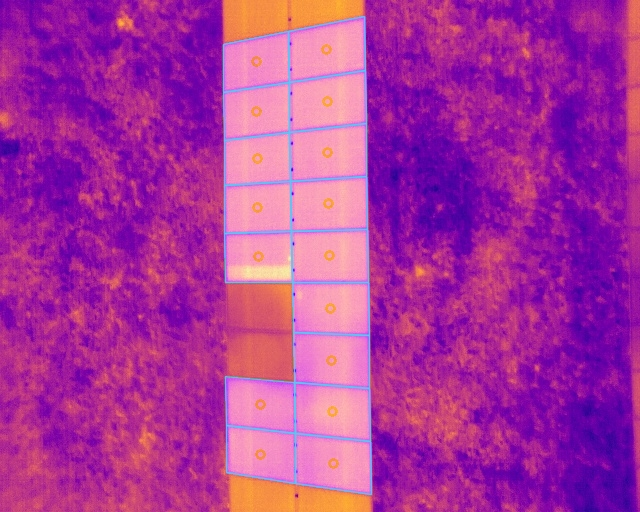

# Automated Solar Panel Detection

## Transform Solar Farm Monitoring with AI-Powered Vision

An intelligent automation system that **revolutionizes how solar installations are inspected and maintained**. Using advanced artificial intelligence and drone imagery, this solution identifies and maps every individual solar panel across large-scale installations—eliminating manual inspection work and dramatically reducing operational costs.

## The Problem It Solves

Solar farm operators face significant challenges:

- **Manual inspections are slow and expensive** - Walking large installations to check thousands of panels is labor-intensive
- **Defects go unnoticed** - Visual inspections miss thermal anomalies indicating performance issues
- **No automated monitoring** - Lack of scalable solutions for continuous quality control
- **Data labeling bottleneck** - Creating training datasets for AI models requires extensive manual annotation

## The Solution

This system **automatically processes drone thermal imagery** to:

✓ **Instantly detect and map** every solar panel in an installation  
✓ **Identify potential failures** through thermal pattern analysis  
✓ **Generate inspection reports** in minutes instead of days  
✓ **Create labeled datasets** for machine learning applications  

Simply fly a drone over your solar farm, and the system does the rest.

## Real-World Applications

### Solar Farm Operations
Automated quality control for large-scale installations. Regular monitoring without deploying inspection teams. Early detection of underperforming panels before they impact revenue.

### Installation & Commissioning
Verify correct panel placement and alignment. Document as-built configurations automatically. Quality assurance during construction phases.

### Predictive Maintenance
Identify hot spots indicating potential failures. Track panel performance trends over time. Prioritize maintenance based on thermal signatures.

### Research & Development
Generate labeled training data for solar panel AI models. Benchmark different detection algorithms. Accelerate development of renewable energy monitoring solutions.

## Key Benefits

- **Save Time** - Process hundreds of panels in minutes vs. hours of manual work
- **Reduce Costs** - Eliminate expensive manual inspection labor
- **Increase Accuracy** - AI achieves 95.7% detection accuracy (IoU score), regardless of conditions
- **Scale Effortlessly** - Handle installations of any size with batch processing
- **Flexible Integration** - Export data in industry-standard formats for your existing workflows
- **Future-Proof** - Built on proven deep learning technology that improves with use

## How It Works

1. **Capture** - Fly drone over solar installation with thermal camera
2. **Process** - Upload images to the detection system
3. **Detect** - AI identifies and maps each panel automatically
4. **Export** - Receive annotated data in your preferred format

No complex setup. No specialized training required.

## Example Detection

Below is a sample thermal image showing solar panels being analyzed by our system. The AI automatically identifies and maps each individual panel, even in varying thermal conditions.

*Thermal image showing solar panel detection in action*

## Proven Results

✓ **95.7% detection accuracy** (IoU score) on test datasets  
✓ **Multiple AI models trained** - 4-layer, 6-layer, and U-Net++ architectures  
✓ Successfully deployed on real-world solar installations  
✓ Handles various weather conditions and lighting scenarios  
✓ Works with both grayscale and RGB thermal imagery  
✓ Validated on drone imagery from multiple sites  

## License

Creative Commons Attribution-NonCommercial 4.0 International (CC BY-NC 4.0)

---

*This project demonstrates the practical application of computer vision and deep learning for renewable energy infrastructure monitoring and automation.*
